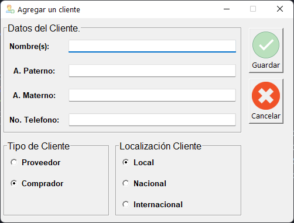

# Client Sync

> App para el control de Inventario de productos.

Desarrollo en proceso, para la practica y uso de los conocimientos adquiridos en el aprendizaje de python,
programa sencillo para cubrir un registro basico de un cliente, sus productos, datos básicos del mismo y un 
control de ingresos de los productos.

## Desarrollado con el uso:

1. Python 3.10
2. Tk Interface
3. POO
4. SQLite

## App en ejecución

> Ingresar un nuevo cliente.

> Busqueda de clientes.

